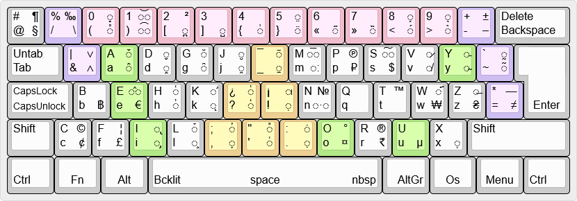
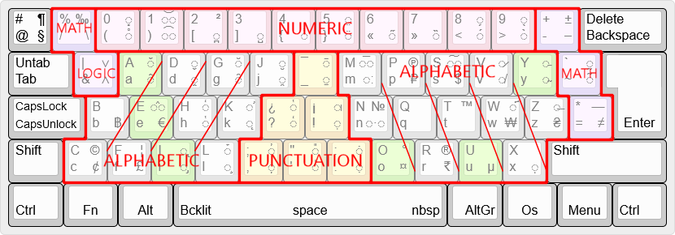
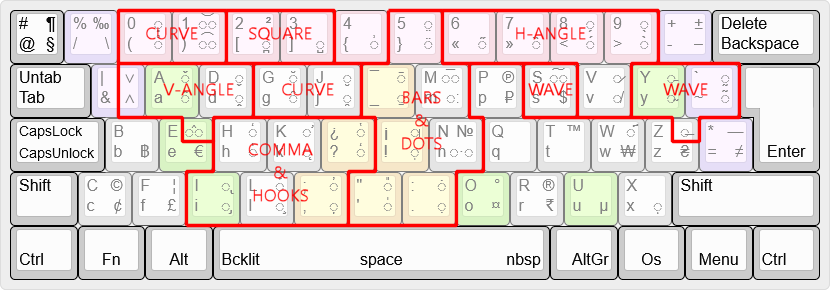

# wm_key_map_cfilorux

Culturally neutral alphabetical keyboard layout.

* Home

https://github.com/wenuam/wm_key_map_cfilorux

## Goals

Keyboard layout that isn't tailored for a specific language or based on technological legacy (typewriter jamming).

The layout features are :

* Alphabetical (columns based, not rows)
* Ergonomic orientation (to prevent RSI)
* Diacritics for accents (via dead keys)
* Programmer oriented (for special symbols)

Note that numbers start at 0, like it should (like on the numeric pad).

## Rationales

The EN-US keyboard is very programmer friendly, having all the special symbols at reach, whereas the FR keyboard is cumbersome in that regard (AFNOR update improves a bit).

Switching between keyboard mapping every now and then to better suit a specific task is also a burden since the physical keycaps don't reflect the selected mapping. Unless you use stickers.

Having multiple keyboards isn't an option also, so why not creating a new layout, freed from all the previous constraints ?

Get an idea of the problem :

* https://en.wikipedia.org/wiki/Keyboard_layout
* http://kbdlayout.info/
* https://keyshorts.com/blogs/blog/44712961-how-to-identify-laptop-keyboard-localization

Even [Bépo] and [Dvorak] have various versions.

[Bépo]: https://kbdlayout.info/kbdfrnb
[Dvorak]: https://en.wikipedia.org/wiki/Dvorak_keyboard_layout

* Hence an alphabetical oriented mapping, yet with a catch because column based, which would allocate each finger to a part of the alphabet (3 letters or less).

* As for the ergonomic orientation, I took the hint from [A4Tech]'s "[Natural_A]" keyboard's trapezoidal shaped keycaps.

[A4Tech]: https://www.a4tech.com/
[Natural_A]: https://www.a4tech.com/search.aspx?key=natural_a

Someone else also had the same idea : https://github.com/diyism/MyBoard

* For the various accents, most of the diacritics and dead-keys are used to insert them. It may require a bit of "finger gymnastic" but auto-correction softwares are expected to alleviate this issue.

These diacritics are generally located near keys having the same "shape" or "orientation" to ease locating them.

* There was no strictly programmer oriented keyboard, yet some variants exists. So the top rom is dedicated to special symbols, mathematics and logical operations.

Numbers are generally available on the numeric pad, hence the top row favour special symbols.

## Folders

* /doc : documentation
* /fnt : fonts used to create the keyboard layout files
* /img : pictures displayed here
* /key : cfilorux layout files for various keyboards (SVG)
* /map : cfilorux mapping files for Linux and Windows
