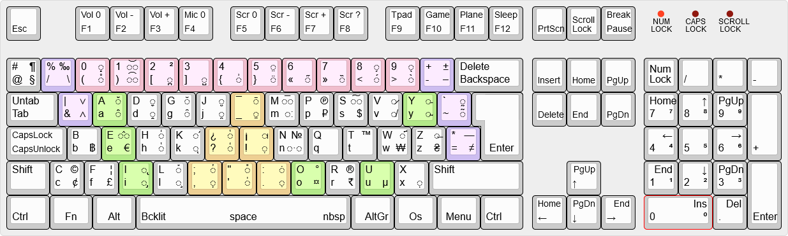

# wm_key_layout_cfilorux

Culturally neutral alphabetical keyboard layout.

Version 2 (231212) :

Version 1 (231210) : 6611d0e

## Goals

The main idea is to propose a new keyboard layout that isn't tailored for a specific language or based on technological legacy (typewriter jamming).

The layout features are :

* Alphabetical (columns based, not rows)
* Ergonomic orientation (to prevent RSI)
* Diacritics for accents (via dead keys)
* Programmer oriented (for special symbols)

## Rationales

The EN-US keyboard is very programmer friendly, having all the special symbols at reach, whereas the FR keyboard is cumbersome in that regard.

Switching between keyboard mapping every now and then to better suit a specific task is also cumbersome since the keycaps don't reflect the selected mapping. Unless you use stickers.

Having multiple keyboards isn't an option also, so why not creating a new layout, freed from all the previous constraints ?

Get an idea of the problem :

* https://en.wikipedia.org/wiki/Keyboard_layout
* http://kbdlayout.info/
* https://keyshorts.com/blogs/blog/44712961-how-to-identify-laptop-keyboard-localization

Even [Bépo] and [Dvorak] have various versions.

[Bépo]: https://kbdlayout.info/kbdfrnb
[Dvorak]: https://en.wikipedia.org/wiki/Dvorak_keyboard_layout

* Hence an alphabetical oriented mapping, yet with a catch because column based, which would allocate each finger to a part of the alphabet (3 letters or less).

* As for the ergonomic orientation, I took the hint from [A4Tech]'s "[Natural_A]" keyboard's trapezoidal shaped keycaps.

[A4Tech]: https://www.a4tech.com/
[Natural_A]: https://www.a4tech.com/search.aspx?key=natural_a

* For the various accents, most of the diacritics and dead-keys are used to insert them. It may require a bit of "finger gymnastic" but I expect auto-correction software to alleviate this issue.

These diacritics are generally located near keys having the same "shape" to ease locating them.

* There was no strictly programmer oriented keyboard, yet some variants exists. So the top rom is dedicated to special symbols, mathematics and logical operations.

Numbers are generally available on the numeric pad, hence the top row favour special symbols.

## Documentation

Some useful links :

Unicode

* https://www.compart.com/en/unicode/ / https://www.compart.com/en/unicode/block/U+0300
* https://symbl.cc/en/unicode/ / https://symbl.cc/en/unicode/table/#combining-diacritical-marks

Diacritics

* https://en.citizendium.org/wiki/Diacritic
* https://en.wikipedia.org/wiki/Diacritic
* https://fr.wikipedia.org/wiki/Diacritiques_de_l%27alphabet_latin
* https://bepo.fr/wiki/Touches_mortes

Special symbols

* https://mycodetips.com/tipstricks/special-characters-and-symbols-in-programming-languages-3624.html
* https://stackoverflow.com/questions/3421532/frequency-of-symbols-in-programming-languages
* http://www.knosof.co.uk/cbook/

Language codes

* https://en.wikipedia.org/wiki/List_of_ISO_639-1_codes

Making your own layout

* https://support.wasdkeyboards.com/hc/en-us/articles/115009403848-Intro-to-Custom-Layouts
* https://www.tuxedocomputers.com/en/Infos/Help-Support/Frequently-asked-questions/Keyboards-Layouts_1.tuxedo
* https://www.tuxedocomputers.com/en/Infos/Help-Support/Instructions/Keyboard-laser-etching-and-logo-printing-service.tuxedo
* https://inkscape-manuals.readthedocs.io/

## Mapping

Keyboard mapping utilities depends on the operating system in use :

* Windows : [Microsoft Keyboard Layout Creator] / https://msklc-guide.github.io/

[Microsoft Keyboard Layout Creator]: https://www.microsoft.com/en-us/download/details.aspx?id=102134

You can also use tools to test the relevance of a mapping :

* http://patorjk.com/keyboard-layout-analyzer/
* https://keyboardsimulator.xyz/

## Keycaps

The layout is already implemented for different keyboards :

* CORSAIR [Vengeance K95 RGB] (Limited Edition)
* TUXEDO [Sirius 16 - Gen1]
* TUXEDO [Stellaris 16 - Gen5 - AMD]

[Vengeance K95 RGB]: https://www.corsair.com/us/en/p/keyboards/ch-9000060-na/vengeance-k95-rgb-limited-edition-fully-mechanical-gaming-keyboard-cherry-mx-red-ch-9000060-na
[Sirius 16 - Gen1]: https://www.tuxedocomputers.com/en/TUXEDO-Sirius-16-Gen1.tuxedo
[Stellaris 16 - Gen5 - AMD]: https://www.tuxedocomputers.com/en/TUXEDO-Stellaris-16-Gen5-AMD.tuxedo

## Fonts

Some fonts were used to create to keycaps :

Google fonts

* https://github.com/google/fonts (Exo 2 by Natanael GAMA)
* https://github.com/google/material-design-icons / https://fonts.google.com/icons
* https://github.com/ionic-team/ionicons / https://ionic.io/ionicons

Symbols

* https://www.tuxedocomputers.com/en/Key-combinations-and-special-keys.tuxedo

Specific fonts

* https://kinsta.com/blog/best-programming-fonts/
* https://collab.its.virginia.edu/wiki/toolbox/Unicode%20Diacritic%20Fonts.html

Free fonts

* https://www.cufonfonts.com/
* https://www.fontspace.com/
* https://www.1001fonts.com/

## Archives

Here are the previous attempts that led to this version :

* http://www.keyboard-layout-editor.com/#/gists/a64eae70f4f459e1325f92014f825195
* http://www.keyboard-layout-editor.com/#/gists/c2ca5f0f7dc0f5527d60b11fadf26018
* http://www.keyboard-layout-editor.com/#/gists/8ff177453d8869cd82990cd966ee7c62

First public mention :

* https://deskthority.net/viewtopic.php?t=17889

## Troubleshot

In case something might break :

* https://www.tuxedocomputers.com/en/Infos/Help-Support/Help-for-my-device/TUXEDO-Polaris-series/TUXEDO-Polaris-15/Special-keys-assignment.tuxedo
* https://www.tuxedocomputers.com/en/Infos/Help-Support/Instructions/Updating-EFI-BIOS-EC.tuxedo
* https://github.com/tuxedocomputers/tuxedo-keyboard

Other sources of tweaks :

* https://encarsia.github.io/en/posts/tuxedo-keyboard-tweaks/
* https://forum.manjaro.org/t/built-in-keyboard-issues-on-tuxedo-computer/40209
* https://www.reddit.com/r/tuxedocomputers/comments/ktaqa2/pulse_14_completely_wrong_fn_keys_with_tuxedo_os/
* https://www.reddit.com/r/tuxedocomputers/comments/kn0vuo/pulse_15_fn_keys_layout/
